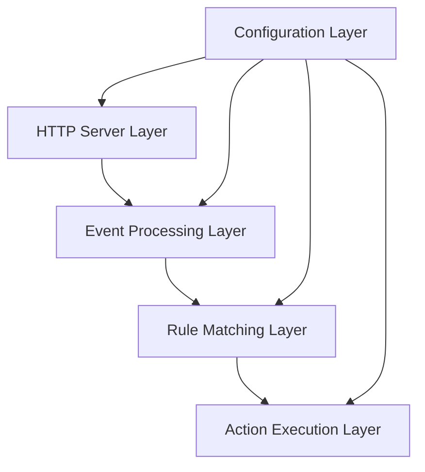
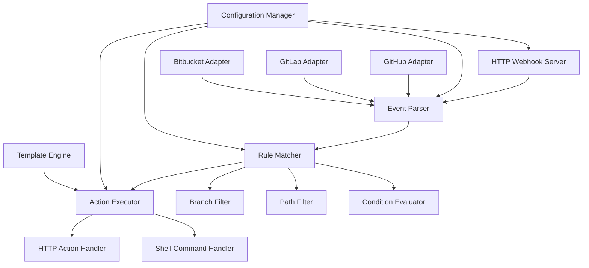
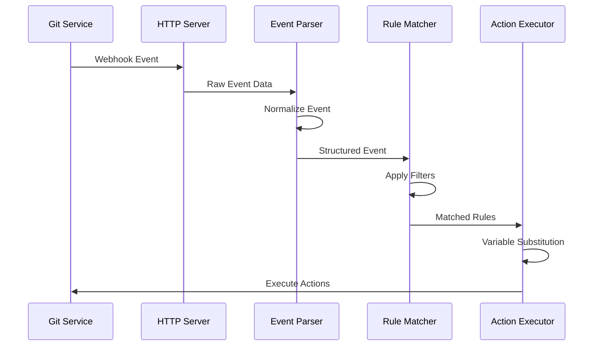

# Git-Actions: Architecture Document

## 1. System Overview and High-Level Architecture

Git-Actions is a Rust-based automation tool designed to listen for Git events and execute configurable actions based on customizable rules. The system follows a modular architecture centered around event processing, rule matching, and action execution.

### 1.1 High-Level Architecture

The system architecture is organized into several key layers:



#### Layer Responsibilities

1. **HTTP Server Layer**
   - Listens for incoming webhook events from Git hosting services
   - Handles HTTP request/response lifecycle
   - Validates webhook signatures and authentication
   - Routes requests to appropriate handlers
   - Implements health check and metrics endpoints

2. **Event Processing Layer**
   - Parses raw webhook payloads from different Git providers
   - Normalizes events into a common internal representation
   - Extracts relevant metadata (branch, commit, files changed, etc.)
   - Provides platform-specific adapters. **Currently, only Bitbucket Data Center/Server is implemented.** Support for GitHub and GitLab webhooks is planned for future releases.

3. **Rule Matching Layer**
   - Evaluates events against defined rules
   - Applies branch filters to determine if the event branch matches rule criteria
   - Applies path filters to check if changed files match rule patterns
   - Evaluates conditional expressions using event data
   - Determines which rules should trigger actions

4. **Action Execution Layer**
   - Executes actions for matched rules
   - Performs variable substitution in action parameters
   - Handles HTTP requests for HTTP actions
   - Executes shell commands for shell actions
   - Manages timeouts and retries
   - Captures and processes action results

5. **Configuration Layer**
   - Loads and parses YAML configuration files
   - Validates configuration against schema
   - Provides access to configuration data throughout the system
   - Handles environment variable substitution in configuration

### 1.2 Core Components



### 1.3 Data Flow



#### Detailed Data Flow Description

1. **Webhook Event Reception**
   - Git hosting service (GitHub, GitLab, or Bitbucket) sends a webhook event to the HTTP server
   - The server validates the webhook signature using the configured secret
   - The raw JSON payload and HTTP headers are captured for processing

2. **Event Parsing and Normalization**
   - The appropriate event parser is selected based on the webhook source
   - The parser extracts relevant information from the raw payload:
     - Event type (push, pull_request, etc.)
     - Repository information
     - Branch name
     - Commit details
     - Changed files
     - Author information
   - The extracted data is normalized into a common internal `Event` structure

3. **Rule Matching Process**
   - The rule matcher evaluates the normalized event against all defined rules
   - For each rule, the following checks are performed:
     - Event type matching: Does the event type match any in the rule's `event_types` list?
     - Branch filtering: Does the event's branch match any of the rule's branch patterns?
     - Path filtering: Do any of the changed files match the rule's path patterns?
     - Condition evaluation: Do all additional conditions evaluate to true?
   - Rules that pass all checks are collected for action execution

4. **Action Execution**
   - For each matched rule, the associated actions are executed in sequence
   - Before execution, variable substitution is performed:
     - Event data is injected into action parameters
     - Environment variables are resolved
     - Template expressions are evaluated
   - For HTTP actions:
     - The URL is constructed with variables substituted
     - Headers are prepared with authentication if needed
     - The HTTP request is made with the specified method and payload
     - Response is captured and logged
   - For shell actions:
     - The command is constructed with variables substituted
     - The working directory is set
     - Environment variables are configured
     - The command is executed in a subprocess
     - Output is captured and logged

5. **Result Handling**
   - Action results are logged for monitoring
   - Errors are handled according to the configured error handling strategy
   - Metrics are updated for monitoring and reporting

## 2. Module Structure

The codebase is organized into the following module structure:

```mermaid
graph TD
    main[main.rs] --> server[server/mod.rs]
    main --> config[config/mod.rs]
    main --> event[event/mod.rs]
    main --> rule[rule/mod.rs]
    main --> action[action/mod.rs]
    
    server --> server_http[server/http.rs]
    server --> server_webhook[server/webhook.rs]
    
    config --> config_loader[config/loader.rs]
    config --> config_validator[config/validator.rs]
    config --> config_types[config/types.rs]
    
    event --> event_parser[event/parser.rs]
    event --> event_github[event/github.rs]
    event --> event_gitlab[event/gitlab.rs]
    event --> event_bitbucket[event/bitbucket.rs]
    event --> event_types[event/types.rs]
    
    rule --> rule_matcher[rule/matcher.rs]
    rule --> rule_filter[rule/filter.rs]
    rule --> rule_condition[rule/condition.rs]
    rule --> rule_types[rule/types.rs]
    
    action --> action_executor[action/executor.rs]
    action --> action_http[action/http.rs]
    action --> action_shell[action/shell.rs]
    action --> action_types[action/types.rs]
    
    template[template/mod.rs] --> action
    template --> template_engine[template/engine.rs]
    template --> template_context[template/context.rs]
```



### 2.1 Module Descriptions

#### 2.1.1 Main Module (`main.rs`)
- Entry point for the application
- Initializes configuration
- Sets up the HTTP server
- Configures logging

#### 2.1.2 Server Module (`server/`)
- **`mod.rs`**: Server module entry point
- **`http.rs`**: HTTP server implementation using a web framework
- **`webhook.rs`**: Webhook endpoint handlers

#### 2.1.3 Configuration Module (`config/`)
- **`mod.rs`**: Configuration module entry point
- **`loader.rs`**: YAML configuration file loading
- **`validator.rs`**: Configuration validation
- **`types.rs`**: Configuration data structures

#### 2.1.4 Event Module (`event/`)
- **`mod.rs`**: Event module entry point
- **`parser.rs`**: Generic event parsing logic
- **`bitbucket.rs`**: Bitbucket-specific event parsing (**Note:** Currently supports Bitbucket Data Center/Server, not Bitbucket Cloud).
- **`types.rs`**: Event data structures
- **Note:** GitHub and GitLab specific parsing (`github.rs`, `gitlab.rs`) are planned for future implementation.

#### 2.1.5 Rule Module (`rule/`)
- **`mod.rs`**: Rule module entry point
- **`matcher.rs`**: Rule matching logic
- **`filter.rs`**: Branch and path filtering
- **`condition.rs`**: Condition evaluation
- **`types.rs`**: Rule data structures

#### 2.1.6 Action Module (`action/`)
- **`mod.rs`**: Action module entry point
- **`executor.rs`**: Action execution orchestration
- **`http.rs`**: HTTP action implementation
- **`shell.rs`**: Shell command action implementation
- **`types.rs`**: Action data structures

#### 2.1.7 Template Module (`template/`)
- **`mod.rs`**: Template module entry point
- **`engine.rs`**: Tera template engine integration
- **`context.rs`**: Template context building

### 2.2 Key Interfaces

#### Event Interface
```rust
// Normalized event representation
pub struct Event {
    pub event_type: EventType,
    pub source: EventSource,
    pub repository: String,
    pub branch: Option<String>,
    pub author: Option<String>,
    pub commit_hash: Option<String>,
    pub changed_files: Vec<String>,
    pub payload: serde_json::Value, // Original payload
}

// Event parser trait
pub trait EventParser {
    fn parse(&self, payload: &[u8], headers: &HashMap<String, String>) -> Result<Event, EventError>;
    fn validate_webhook(&self, payload: &[u8], headers: &HashMap<String, String>) -> Result<(), EventError>;
}
```

#### Rule Matching Interface
```rust
// Rule matcher
pub trait RuleMatcher {
    fn matches(&self, event: &Event, rule: &Rule) -> bool;
}

// Filter trait
pub trait Filter {
    fn matches(&self, value: &str) -> bool;
}
```

#### Action Execution Interface
```rust
// Action executor
pub trait ActionExecutor {
    fn execute(&self, action: &Action, context: &ActionContext) -> Result<ActionResult, ActionError>;
}

// Action context
pub struct ActionContext<'a> {
    pub event: &'a Event,
    pub rule: &'a Rule,
    pub env: &'a HashMap<String, String>,
}