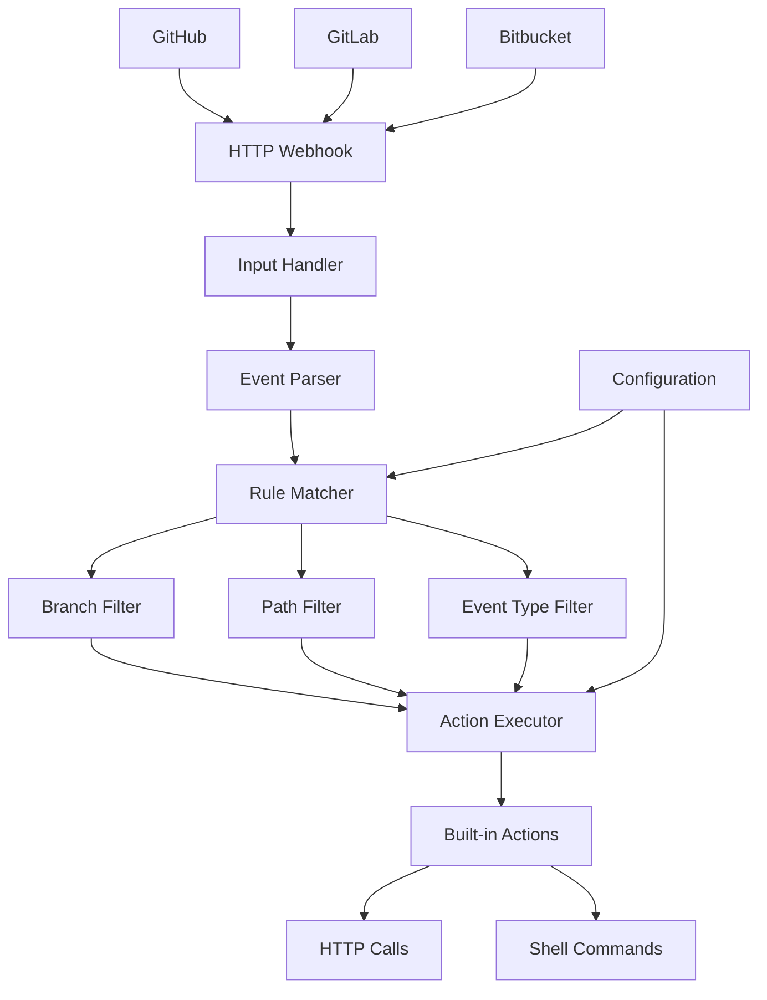

# Git-Actions: Event-Based Automation Tool Specification

## 1. Introduction

### 1.1 Purpose and Objectives

Git-Actions is a Rust-based automation tool designed to listen for Git events and execute configurable actions based on customizable rules. The primary goal is to streamline and automate CI/CD workflows by responding to specific Git events with targeted actions.

Key objectives:
- Provide a lightweight, configurable event-based automation system
- Enable fine-grained control over which events trigger which actions
- Support common Git hosting platforms out of the box
- Optimize CI/CD workflows particularly in monorepo environments
- Allow flexibility in action execution based on detailed rule matching

### 1.2 Key Capabilities

- Event listening via HTTP webhook
- Support for GitHub, GitLab, and Bitbucket events
- Rule-based event filtering by branch, path, and event type
- Parameterized actions with variable substitution
- Built-in HTTP call and shell command actions
- Detailed path and file filtering
- Conditional execution based on event properties
- Support for action chaining and sequential workflows
- Future extensibility via a plugin system

### 1.3 Target Users

- DevOps engineers managing CI/CD pipelines
- Development teams using Git-based workflows
- Organizations with monorepo architectures
- Platform engineering teams building developer infrastructure
- Anyone seeking to automate processes in response to Git events

## 2. System Architecture

### 2.1 High-Level Design

Git-Actions follows a modular architecture centered around event processing, rule matching, and action execution. The system receives events from Git hosting services, processes them against defined rules, and executes matched actions.

### 2.2 Component Diagram



### 2.3 Data Flow

1. Events are received through HTTP webhooks
2. The Input Handler normalizes the event data
3. The Event Parser extracts relevant information based on the source (GitHub, GitLab, etc.)
4. The Rule Matcher evaluates the event against all defined rules
5. For each matched rule, the Action Executor processes the associated actions
6. Actions are executed with variable substitution from the event data
7. Results and logs are recorded for monitoring

### 2.4 HTTP Webhook Interface

The tool runs an HTTP server that listens for incoming webhook events from Git hosting services. The endpoint can be configured with:
- Port number
- TLS/SSL certificates
- Authentication requirements
- Rate limiting

## 3. Event Handling

### 3.1 Supported Git Event Sources

#### 3.1.1 GitHub

- Supports standard GitHub webhook payload format
- Validates webhook signatures
- Parses GitHub-specific event types and structures

#### 3.1.2 GitLab

- Supports GitLab webhook payloads
- Handles GitLab-specific event structures
- Validates GitLab webhook tokens

#### 3.1.3 Bitbucket

- Supports Bitbucket webhook payloads
- Handles Bitbucket-specific event structures
- Supports Bitbucket Cloud and Server variants

### 3.2 Webhook Interface

- RESTful HTTP endpoint
- JSON payload processing
- Webhook secret validation
- Automatic source detection
- Error handling with appropriate HTTP responses

### 3.3 Event Types

The tool supports the following primary event types:

| Event Type | Description |
|------------|-------------|
| push | Code pushed to a branch |
| pull_request.opened | New pull request created |
| pull_request.updated | Pull request updated with new commits |
| pull_request.merged | Pull request merged into target branch |
| pull_request.closed | Pull request closed without merging |
| tag | New tag created |
| release | New release created |

Additional event types can be supported based on the Git hosting service's capabilities.

### 3.4 Payload Parsing

The tool normalizes different webhook payload formats into a standardized internal event representation. This includes:

- Event type normalization
- Branch information extraction
- Commit details processing
- File change information extraction
- Author and timestamp metadata handling
- PR/MR status information

### 3.5 Manual Event Triggering

Events can be manually triggered by:
- Sending webhook-like payloads to the HTTP endpoint
- Using a simple CLI interface for generating test events

## 4. Rule System

### 4.1 Rule Structure

Each rule consists of:
- Event type filters
- Branch filters
- Path filters
- Conditional expressions
- Associated actions

Example rule structure:
```yaml
rules:
  - name: "Docker Build Rule"
    description: "Trigger Docker build when Dockerfile changes"
    event_types:
      - pull_request.merged
    branches:
      - pattern: "feature/*"
      - exact: "main"
      - exact: "develop"
    paths:
      - pattern: "cicd/Dockerfile"
      - pattern: "docker/**/*"
    conditions:
      - "$.event.author != 'dependabot'"
    actions:
      - type: "http"
        url: "https://ci-server/api/build"
        method: "POST"
        payload:
          repository: "$.event.repository"
          branch: "$.event.branch"
      - type: "shell"
        command: "docker build -t myapp ."
```

### 4.2 Event Matching

The rule matcher evaluates incoming events against all defined rules, determining which rules should trigger actions. The matching process:

1. Checks if the event type matches any of the rule's event types
2. Verifies if the event's branch matches any of the branch filters
3. Confirms if any changed files match the path filters
4. Evaluates any additional conditions
5. Considers a rule matched only when all criteria are satisfied

### 4.3 Branch Filtering

Branch filters can be specified as:
- Exact matches (`exact: "main"`)
- Pattern matches using glob syntax (`pattern: "feature/*"`)
- Regular expression matches (`regex: "^release-\d+\.\d+$"`)
- Exclusion patterns (`not: "temp/*"`)

### 4.4 Path/File Filtering

Path filters determine which file changes should trigger the rule:
- Exact file paths (`exact: "package.json"`)
- Directory path patterns (`pattern: "src/**/*.js"`)
- Regular expressions (`regex: ".*\.sql$"`)
- Exclusion patterns (`not: "**/*.md"`)

### 4.5 Pattern Matching Capabilities

The tool supports multiple pattern matching syntaxes:
- Glob patterns (`**/*.js`, `src/{models,controllers}/*.ts`)
- Regular expressions (`^src/.*\.rs$`)
- Simple wildcards (`*.go`, `config/**/prod.yaml`)
- Negation patterns (`!tests/**/*`)

### 4.6 Conditional Expressions

Beyond path and branch filtering, additional conditions can be specified using JSONPath expressions:
- Event property access (`$.event.author == "admin"`)
- Logical operators (`&&`, `||`, `!`)
- Comparison operators (`==`, `!=`, `>`, `>=`, `<`, `<=`)
- Functions (`contains()`, `startsWith()`, `endsWith()`)
- JSONPath operators (`@`, `$`, `*`, `..`)
- Array filters (`[?(@.property=='value')]`)

## 5. Action Framework

### 5.1 Built-in Action Types

#### 5.1.1 HTTP Action

Sends HTTP requests to specified endpoints:
- Supports GET, POST, PUT, DELETE methods
- JSON payload construction with variable substitution
- Header configuration
- Authentication options (Basic, Bearer, Custom)
- Response handling and validation

Example:
```yaml
type: "http"
url: "https://api.example.com/webhook"
method: "POST"
headers:
  Content-Type: "application/json"
  Authorization: "Bearer $.secrets.API_TOKEN"
payload:
  repository: "$.event.repository"
  branch: "$.event.branch"
  files: "$.event.changed_files"
```

#### 5.1.2 Shell Command Action

Executes shell commands with parameterization:
- Command specification with variable substitution
- Working directory configuration
- Environment variable setting
- Timeout controls
- Output capturing and processing

Example:
```yaml
type: "shell"
command: "deploy.sh --branch=$.event.branch --env=production"
working_dir: "/path/to/scripts"
environment:
  API_KEY: "$.secrets.API_KEY"
  DEBUG: "true"
timeout: 300 # seconds
```

### 5.2 Parameter Substitution

Actions support variable substitution using the following JSONPath syntax:
- `$.event.property` - Access event properties
- `$.rule.property` - Access the matched rule properties
- `$.secrets.name` - Access configured secrets
- `$.env.VAR_NAME` - Access environment variables

### 5.3 Variable Expansion

Complex variable expansions are supported:
- Array iteration: `$each($.event.files, "file ->")`
- Conditionals: `$if($.condition, then_value, else_value)`
- String operations: `$replace()`, `$substring()`, `$lowercase()`
- JSON manipulation: `$json()`, `$parse()`, `$stringify()`
- JSONPath queries: `$jsonpath($.event, "$.payload.commits[*].id")`

### 5.4 Action Chaining

Multiple actions can be defined for a single rule:
- Sequential execution in the order defined
- Conditional execution based on previous action results
- Data passing between actions
- Early termination options

### 5.5 Error Handling

Actions include robust error handling capabilities:
- Configurable retry logic
- Failure tolerance settings
- Timeout controls
- Error notification options
- Fallback actions

## 6. Configuration Format

### 6.1 YAML Schema

The tool uses YAML for configuration with the following top-level structure:

```yaml
version: "1"

# Global settings
settings:
  http:
    enabled: true
    port: 8080
    path: "/webhook"

  security:
    github_secret: "$.env.GITHUB_SECRET"
    gitlab_token: "$.env.GITLAB_TOKEN"
    bitbucket_username: "$.env.BB_USERNAME"
    bitbucket_password: "$.env.BB_PASSWORD"

# Rules configuration
rules:
  - name: "Rule 1"
    description: "Sample rule"
    event_types: [...]
    branches: [...]
    paths: [...]
    conditions: [...]
    actions: [...]

  - name: "Rule 2"
    ...
```

Each configuration file can be validated with the tool's built-in validator.

### 6.2 Example Configurations

See the `docs/examples/` directory for detailed example configurations, including:
- Basic CI/CD workflows
- Monorepo-specific configurations
- Environment-specific deployment rules
- Specialized use cases

## 7. API Reference

### 7.1 Reserved HTTP Endpoints

The following HTTP endpoints are reserved and may not be used in webhook definitions.

#### 7.1.1 Metrics Endpoint

- `GET /metrics`
  - Returns detailed service metrics
  - Includes:
    - Uptime (time since service start)
    - Events processed (total count of received events)
    - Rules matched (count of successful rule matches)
    - Events with no matching rule (count of events that didn't match any rules)
    - Action errors (count of failed action executions)

#### 7.1.2 Health Check

- `GET /health`
  - Simple health check endpoint
  - Returns 200 OK if service is running properly

## 8. Deployment & Operation

### 8.1 System Requirements

- Operating System: Linux, macOS, or Windows
- Minimal resource requirements:
  - CPU: 1 core
  - Memory: 64MB minimum, 128MB recommended
  - Disk: 10MB for the binary, plus log storage
- Network:
  - Inbound connections for HTTP webhook
  - Outbound connections for HTTP actions

### 8.2 Monitoring and Logging

- Log levels: ERROR, WARN, INFO, DEBUG, TRACE
- Log formats: Plain text, JSON, structured
- Metrics:
  - Events received per source
  - Rules matched
  - Actions executed
  - Execution times
  - Error rates
- Health checks:
  - Process health
  - Memory usage
  - Event processing backlog

---

For detailed example configurations, see the files in the `docs/examples/` directory.
